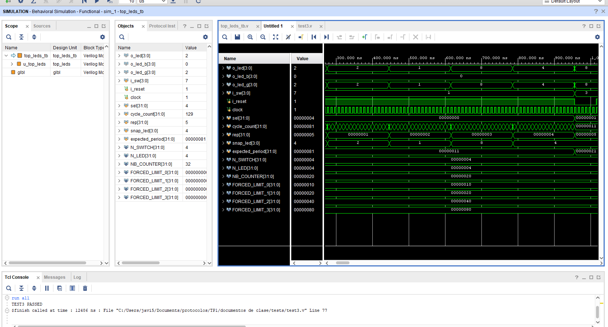
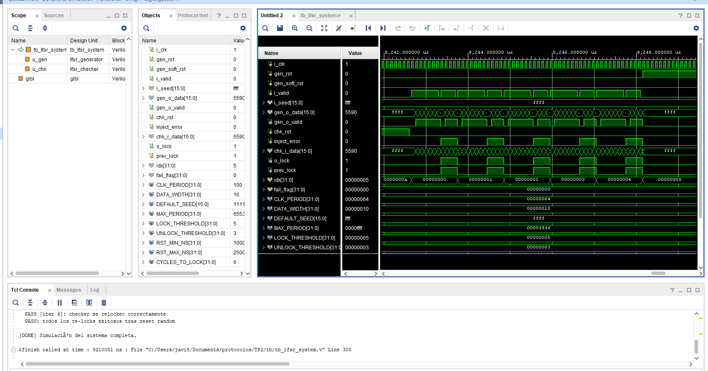

# Informe — Trabajos Prácticos 1 y 2

**Curso:** Protocolos de Comunicacion — Fundación Fulgor  
**Docentes:** Facundo Sposetti, Jorge Manuel Finochietto  
**Alumno:** Francisco Javier Vásquez  
**Fecha:** Agosto de 2026  

---

## Índice

1. [Introducción](#introducción)
2. [TP1 — Proyecto LEDs](#tp1--proyecto-leds)
3. [TP2 — Generador LFSR](#tp2--generador-lfsr)
4. [Conclusiones generales](#conclusiones-generales)

---

## Introducción

Este informe documenta la resolución de los Trabajos Prácticos 1 y 2 del curso de Protocolos de Comunicacion. Ambos trabajos abordan el diseño, la implementación y la verificación de módulos digitales en Verilog:

- **TP1** aborda el flujo de trabajo de diseño digital sobre FPGA: un sistema simple (contador + registro de desplazamiento que controla un patrón de LEDs), su verificación funcional mediante testbench, y su síntesis, implementación y generación de bitstream en **Xilinx Vivado**, con los IP cores de depuración **VIO** (Virtual Input/Output) e **ILA** (Integrated Logic Analyzer) ya instanciados en el código. La programación final sobre la FPGA física (vía el servidor remoto de la cátedra) quedó pendiente por un problema de acceso a ese servidor. El diseño RTL fue resuelto en términos generales de forma conjunta entre todos los cursantes, guiados por el docente; el trabajo propio se concentró en el diseño de la batería de tests del testbench.
- **TP2** profundiza en el diseño de un **generador de secuencias pseudoaleatorias (LFSR)** y de un módulo verificador de esa secuencia (**checker**), con énfasis en el diseño de máquinas de estado y el manejo de señales de control (`valid`, resets sincrónico/asincrónico). Para este TP, se abordo tanto el diseño (generador, checker) como la verificación (testbenches y baterías de tests) de manera mas individual, pero guiada por el docente.

Este informe reconstruye y explica el razonamiento de diseño, las decisiones tomadas y los resultados obtenidos a partir del código y los testbenches finales.

---

## TP1 — Proyecto LEDs

### 1. Objetivo

El objetivo del trabajo es:

- Diseñar un sistema (`top`) que controle un patrón de LEDs mediante un contador y un registro de desplazamiento (shift register).
- El sistema debe incluir instancias de los IP cores **VIO** e **ILA** de Xilinx para control y debug del módulo top desde la herramienta Vivado, una vez implementado en la FPGA.
- Especificaciones funcionales:
  - `i_reset`: reset del sistema que pone en cero al contador e inicializa el shift register.
  - `i_sw[0]`: habilita (1) o detiene (0) el conteo, sin alterar el estado actual del contador ni del shift register.
  - El shift register se desplaza únicamente cuando el contador alcanza uno de cuatro límites configurables (`R0`–`R3`), seleccionados en cualquier momento mediante `i_sw[2:1]`.
  - `i_sw[3]` selecciona el color de los LEDs RGB (verde o azul).
- **Entregables pedidos:** código Verilog con la instancia de VIO e ILA, testbench en Verilog que valide el diseño, implementación en la FPGA.

> **Nota sobre el alcance del trabajo propio:** el RTL de `counter.v`, `shift_reg.v` y `top_leds.v` (secciones 2 y 4 de este informe) fue resuelto en términos generales de manera conjunta entre todos los cursantes junto con el docente, como parte del trabajo guiado en clase. Lo que correspondió más puntualmente a este entrega fue el diseño e implementación de la batería de 6 tests del testbench (sección 3), pensados para cubrir cada uno de los comportamientos exigidos por la consigna.

### 2. Arquitectura del diseño

El sistema se estructuró en tres módulos, integrados por un módulo top (`top_leds`):

```
top_leds
 ├── counter      (contador con 4 límites configurables)
 ├── shift_reg    (registro de desplazamiento circular de 4 bits)
 ├── vio_0        (Xilinx VIO — solo en síntesis)
 └── ila_0        (Xilinx ILA — solo en síntesis)
```

**`counter.v`** — Contador de 32 bits con cuatro límites (`limit_0`..`limit_3`), seleccionados por `i_sel_count_limit` (2 bits). Al llegar al límite seleccionado, vuelve a 0 y genera un pulso de un ciclo en `o_shift`:

```verilog
assign counter_next = ((i_sel_count_limit == 2'b00) && (counter >= limit_0)) ? 'd0 :
                      ((i_sel_count_limit == 2'b01) && (counter >= limit_1)) ? 'd0 :
                      ((i_sel_count_limit == 2'b10) && (counter >= limit_2)) ? 'd0 :
                      ((i_sel_count_limit == 2'b11) && (counter >= limit_3)) ? 'd0 :
                                                                                counter + 1'b1;
...
assign o_shift = (counter == 'd0);
```

El reset (`i_reset`, activo bajo internamente — `negedge i_reset` en la sensitivity list) es **asíncrono** y lleva el contador a 0. La habilitación (`i_enable`) congela el contador en su valor actual cuando está en 0, sin resetearlo — esto es clave para que el TEST1 del testbench pase (verifica que deshabilitar el conteo no reinicia el estado).

Un detalle de diseño relevante: `o_shift` se define como `counter == 0`, de modo que **el primer pulso de shift ocurre inmediatamente después del reset** (cuando el contador arranca en 0), y luego cada `limit + 1` ciclos. Este comportamiento se verifica explícitamente en TEST3.

**`shift_reg.v`** — Registro de desplazamiento circular de 4 bits que rota un único bit encendido (`4'b1000` tras el reset). Solo rota cuando `i_shift` (proveniente de `o_shift` del contador) e `i_enable` están ambos activos:

```verilog
always@(posedge clock or negedge i_reset)
begin
  if      (!i_reset)
    shift_register <= 4'b1000;
  else if (i_shift && i_enable)
    shift_register <= {shift_register[0], shift_register[NB_SHIFT_REG-1:1]};
end
```

**`top_leds.v`** — Integra ambos módulos y agrega la lógica de colorización RGB:

```verilog
assign o_led   =  led_enable;
assign o_led_b = ( sw3_int) ? led_enable : 4'b0000;
assign o_led_g = (!sw3_int) ? led_enable : 4'b0000;
```

Es decir, `o_led` siempre refleja el patrón del shift register, y ese mismo patrón se enruta hacia el canal azul o verde según `i_sw[3]`, quedando el canal no seleccionado en 0.

**Instancias VIO/ILA:** para permitir el control y la observación del sistema una vez implementado en la FPGA (sin recompilar el bitstream cada vez que se quiere cambiar un estímulo), `top_leds` incorpora un mux `sel_mux` que decide si las entradas de control provienen de los switches físicos (`i_sw`, `i_reset`) o de los registros virtuales expuestos por el VIO (`vio_sw`, `vio_sw3`, `vio_reset`):

```verilog
assign sw_int    = sel_mux ? vio_sw    : i_sw[2:0];
assign sw3_int   = sel_mux ? vio_sw3   : i_sw[3]  ;
assign reset_int = sel_mux ? vio_reset : i_reset  ;
```

El VIO expone como entradas (monitoreadas en el dashboard de Vivado) los tres buses de LEDs (`o_led`, `o_led_b`, `o_led_g`), y como salidas los controles virtuales (`sel_mux`, `vio_reset`, `vio_sw[2:0]`, `vio_sw3`). El ILA, por su parte, captura los mismos tres buses de LEDs para poder observar su evolución temporal directamente en hardware.

El VIO y el ILA son cores de debug pensados para ser manejados desde el dashboard de Vivado vía JTAG una vez que la FPGA ya está programada: sus entradas de control (`probe_out0..3`) las mueve un usuario interactuando con el hardware, no un testbench. Por eso, instanciarlos en una simulación no aporta nada — quedarían clavados en su valor inicial sin importar qué simulador se use, incluido el propio de Vivado — y además la consigna pide explícitamente que el testbench valide el diseño sin ellos. Para que el mismo archivo sirva tanto para simulación como para síntesis, se usó una directiva de compilación condicional:

```verilog
`ifdef SYNTHESIS
  // instancias de vio_0 e ila_0
`else
  // en simulación, VIO "bypasseado": las entradas físicas pasan directo
  assign sel_mux   = 1'b0;
  assign vio_reset = 1'b1;
  ...
`endif
```


### 3. Verificación (testbench)

Esta es la parte del TP1 que correspondió más directamente a este trabajo: a partir del RTL ya definido en clase, se diseñó el testbench y la batería de tests que lo ejercitan.

El testbench (`top_leds_tb.v`) instancia `top_leds` y provee:

- Generación de clock (`always #5 clock = ~clock`).
- Una `task reset()` que asierta el reset de inmediato, lo mantiene por un tiempo aleatorio (entre 1 y 100 unidades de tiempo) y luego lo desasierta sincronizado con el clock — emulando un reset de duración variable, similar al pedido de la consigna del TP2 pero aplicado aquí al reset del sistema de LEDs.
- Un mecanismo de selección de test vía `` `define TESTn `` que incluye (`` `include ``) el archivo correspondiente de la carpeta `tests/`, permitiendo compilar y correr cada test de forma independiente.

Se implementaron **6 tests**, cada uno enfocado en un aspecto funcional distinto del sistema:

| Test | Qué verifica |
|---|---|
| **TEST1** | Con `i_sw[0] = 0` (conteo deshabilitado), `o_led` no cambia durante un número aleatorio de ciclos (50–500), confirmando que deshabilitar no altera el estado. |
| **TEST2** | El sistema es puramente sincrónico: con el clock forzado en 0 (congelado), ninguna señal de estado (`o_led`, `o_led_b`, `o_led_g`, `counter`, `shift_register`) cambia. |
| **TEST3** | El período entre shifts coincide exactamente con el límite configurado (`limit + 1` ciclos), medido para los 4 valores de `i_sw[2:1]` y verificado durante 5 períodos consecutivos por cada uno. |
| **TEST4** | Comportamiento al cambiar el límite en caliente: **Caso A** (límite mayor→menor, con `counter` ya por encima del nuevo límite) el contador debe resetearse y el shift register debe rotar; **Caso B** (límite menor→mayor) el contador debe seguir incrementando normalmente, sin reset ni shift extra. |
| **TEST5** | `i_sw[3]` controla el canal de color: con `sw[3]=1`, `o_led_b == o_led` y `o_led_g == 0`; con `sw[3]=0`, es al revés. Además confirma que `o_led` en sí no depende de `sw[3]`. |
| **TEST6** | Reset asíncrono: con el clock congelado, al asertar `i_reset` el contador y el shift register vuelven a su estado inicial **sin necesidad de un flanco de clock**, y `o_led` lo refleja inmediatamente. |

Todos los tests usan `force`/`release` sobre señales internas (por ejemplo, forzar los límites del contador a valores pequeños como 16, 32, 64 y 128 ciclos, en lugar de los valores reales de milisegundos) para poder verificar el comportamiento en tiempos de simulación razonables.

Cada test finaliza con un mensaje `$display` indicando `PASS` o `FAIL`, lo que permite verificar rápidamente el resultado de cada corrida en la consola del simulador.

**Bug real encontrado y corregido en TEST1 (verificación cruzada con Icarus Verilog):** al recorrer este testbench con Icarus Verilog (además de Vivado, único simulador documentado originalmente para TP1), `TEST1` fallaba de forma consistente. Causa: el test deshabilita el contador (`i_sw[0] = 0`) inmediatamente después de esperar `$urandom_range(1,5) * 1000` nanosegundos — un múltiplo exacto del período de clock (10 ns) —, por lo que esa espera termina siempre justo sobre un flanco de subida. Eso genera una carrera entre el testbench (bajando `i_sw[0]`) y el `always @(posedge clock)` del contador muestreando `i_enable` en ese mismo flanco — la misma clase de bug ya encontrada y corregida en `send_valid`/`send_invalid` de TP2 (sección "TP2", más abajo). Vivado resuelve esa carrera de forma que no se manifiesta; Icarus la resuelve al revés, dejando que el contador incremente/shiftee un ciclo de más antes de congelarse, lo que dispara el `FAIL`. Se corrigió agregando `@(negedge clock)` antes de bajar `i_sw[0]`, el mismo patrón ya validado en TP2 — con el fix, `TEST1` pasa de forma consistente en ambos simuladores. Los TEST2–TEST6 no presentan el mismo patrón (esperan flancos con `repeat(N) @(posedge clock)` sin un cambio de señal inmediatamente después que dependa de ese flanco puntual) y se verificaron estables en múltiples corridas con Icarus.



*Figura 1. Simulación de comportamiento (Vivado, TEST3) mostrando `o_led`/`o_led_b`/`o_led_g` transicionando junto con `sel` (límite seleccionado) y `expected_period` (0x11→0x21, es decir 17→33 ciclos al pasar de `limit_0` a `limit_1`). La consola confirma `TEST3 PASSED`.*

### 4. Síntesis, implementación y bitstream

El flujo seguido en Vivado (documentado en las diapositivas del curso) fue:

1. Creación de un nuevo proyecto Vivado, seleccionando la placa objetivo (Arty A7-35, según el archivo de restricciones `Arty-A7-35-Master.xdc` incluido en el repositorio).
2. Incorporación de las fuentes de diseño (`counter.v`, `shift_reg.v`, `top_leds.v`), el archivo de restricciones (`.xdc`) y las fuentes de simulación (`top_leds_tb.v` + `tests/*.v`).
3. Configuración e instanciación de los IP cores VIO e ILA desde el IP Catalog, con los parámetros indicados en los comentarios de `top_leds.v` (3 probes de entrada de 4 bits para el VIO, 3 probes de 4 bits para el ILA con profundidad de muestreo 1024).
4. Síntesis, implementación y generación del bitstream — completado sin errores en Vivado local.

> **Pendiente:** el paso final (programar la FPGA física a través del servidor remoto de la cátedra, y capturar el dashboard del VIO y la waveform del ILA ya en hardware) no se pudo completar: el acceso remoto documentado en las diapositivas del curso (túnel SSH a `fulgorip.hopto.org` / `fulgorip1.hopto.org`) no resultó accesible al momento de escribir este informe. El bitstream ya está generado y listo para programarse en cuanto se resuelva ese acceso.

### 5. Conclusiones del TP1

El trabajo permitió recorrer gran parte del flujo de diseño digital: desde la descripción RTL de un sistema con control de tiempo (contador con límites configurables) y control de estado visual (shift register), pasando por una verificación funcional rigurosa mediante testbench con manipulación directa de señales internas, hasta la síntesis, implementación y generación de bitstream en Vivado con los IP cores de VIO/ILA ya instanciados. La programación real sobre la FPGA y la interacción con el VIO/ILA en hardware quedaron pendientes por el problema de acceso al servidor remoto mencionado en la sección anterior. La separación entre lógica de simulación y de síntesis (`` `ifdef SYNTHESIS ``) resultó clave para poder verificar el diseño mediante testbench sin depender de los IP cores propietarios de Xilinx, ya que el VIO y el ILA no tienen manera de ser manejados por un testbench (su control es vía JTAG/hardware manager) sin importar el simulador utilizado, resolviendo así el requisito de "testbench que valide el comportamiento del diseño sin los IP cores".

Vale reiterar que el RTL del sistema fue, en términos generales, un desarrollo conjunto de todo el curso guiado por la cátedra; el aporte propio de este trabajo estuvo puesto principalmente en la verificación: el diseño de los 6 tests que cubren cada requisito funcional de la consigna (habilitación, sincronismo, timing de shift, cambio de límite en caliente, selección de color y reset asíncrono).

---

## TP2 — Generador LFSR

### 1. Objetivo

Este trabajo pide diseñar y verificar un generador de secuencias pseudoaleatorias basado en un **LFSR (Linear Feedback Shift Register)**, junto con un módulo que verifique la validez de esa secuencia. Las actividades pedidas son:

- **Actividad 1:** usar el software provisto (`LFSRTestBench.exe`) para encontrar la configuración de polinomio que genere la secuencia de mayor período posible, e implementar el generador en Verilog con seed configurable, señal de habilitación `i_valid`, reset asíncrono `i_rst` (carga un seed fijo) y reset sincrónico `i_soft_reset` (carga `i_seed`).
- **Actividad 2:** construir el testbench con clock de 10 MHz, reset de duración aleatoria (entre 1 µs y 250 µs), señal de valid aleatoria ciclo a ciclo, y tasks para cambiar la seed y para pulsar cada uno de los dos resets por un tiempo aleatorio.
- **Actividad 3:** verificar la periodicidad del generador, tanto con la seed por defecto como con seeds aleatorias.
- **Actividad 4:** implementar un **LFSR Checker** que se conecte a la salida del generador y determine, ciclo a ciclo, si la secuencia recibida es válida, con una señal `o_lock` que se activa tras 5 aciertos consecutivos y se desactiva tras 3 errores consecutivos.
- **Actividad 5:** integrar el checker al testbench, agregar un monitor de cambios de `o_lock`, y verificar tráfico válido continuo, las condiciones de frontera de lock/unlock, transiciones repetidas, y recuperación tras reset aleatorio del checker.

### 2. Marco teórico: LFSR Fibonacci vs. Galois

La consigna presenta las dos topologías clásicas de LFSR:

- **Fibonacci LFSR:** la realimentación se calcula con una cadena de XOR entre varios bits de salida (los "taps"), y el resultado se inyecta únicamente en la primera posición del registro.
- **Galois LFSR:** en lugar de una única cadena de XOR externa, se insertan compuertas XOR *internas* en cada posición de tap, todas alimentadas por el mismo bit de realimentación (el bit más significativo saliente). Esta topología es la elegida para la implementación, ya que permite que todos los XOR se calculen en paralelo (menor profundidad lógica) en vez de en cadena.

Se utilizó el ejecutable provisto por la cátedra (`LFSRTestbench/LFSRTestbench.exe`) para determinar *un* polinomio que maximice el período de la secuencia. Para un registro de 16 bits, el período máximo posible (secuencia de longitud completa o "maximal length sequence") es 2¹⁶ − 1 = **65535**, y se alcanza con un polinomio primitivo. El polinomio elegido fue:

```
x¹⁶ + x¹⁴ + x¹³ + x¹¹ + 1
```

correspondiente a taps en los bits 11, 13 y 14 (más el bit 15, MSB, como fuente de realimentación). Este polinomio es efectivamente primitivo: el TEST1 del testbench del generador mide el período real y confirma que es exactamente 65535.

Como referencia de partida (código provisto por el ejecutable de la cátedra) se usó `primer_archivo.v`: una implementación mínima del LFSR Galois de 16 bits, sin resets ni control de valid, que sirvió como *golden reference* para confirmar que la topología (ubicación de los taps) estaba bien implementada antes de construir la versión parametrizada y controlable.

### 3. Diseño e implementación

**`rtl/lfsr_generator.v`** — Módulo RTL sintetizable con todas las señales de control pedidas:

| Puerto | Dirección | Descripción |
|---|---|---|
| `i_clk` | in | Clock del sistema |
| `i_rst` | in | Reset asíncrono — carga `DEFAULT_SEED` |
| `i_soft_reset` | in | Reset sincrónico — carga `i_seed` |
| `i_valid` | in | El LFSR solo avanza cuando está en alto |
| `i_seed` | in | Seed configurable en tiempo de ejecución |
| `o_data` | out | Estado actual del registro |
| `o_valid` | out | Compañera registrada de `o_data` |

La lógica de próximo estado (`lfsr_next`) es puramente combinacional, separada del bloque secuencial, y la parte secuencial resuelve la prioridad de control `i_rst > i_soft_reset > i_valid > hold`:

```verilog
always @(posedge i_clk or posedge i_rst) begin
    if (i_rst) begin
        lfsr    <= DEFAULT_SEED;
        o_valid <= 1'b0;
    end else if (i_soft_reset) begin
        lfsr    <= i_seed;      // load runtime seed synchronously
        o_valid <= 1'b0;        // reseed, not a PRBS advance
    end else if (i_valid) begin
        lfsr    <= lfsr_next;   // advance sequence
        o_valid <= 1'b1;
    end else begin
        o_valid <= 1'b0;        // hold — no valid token, no reset
    end
end
```

<svg viewBox="0 0 680 260" xmlns="http://www.w3.org/2000/svg" style="width:100%;max-width:600px;display:block;margin:3mm auto;font-family:Georgia,serif;">
  <defs>
    <marker id="arrow2" viewBox="0 0 10 10" refX="9" refY="5" markerWidth="7" markerHeight="7" orient="auto-start-reverse">
      <path d="M0,0 L10,5 L0,10 z" fill="#1a4d8f"/>
    </marker>
  </defs>
  <text x="190" y="10" text-anchor="middle" font-size="10.5" fill="#1a1a1a">Entradas de control:</text>
  <text x="190" y="24" text-anchor="middle" font-size="10.5" fill="#1a1a1a">i_rst, i_soft_reset, i_valid, i_seed</text>
  <path d="M190,28 L190,78" stroke="#1a4d8f" stroke-width="1.5" fill="none" marker-end="url(#arrow2)"/>
  <rect x="60" y="80" width="260" height="100" rx="8" fill="#eef2f7" stroke="#1a4d8f" stroke-width="1.5"/>
  <text x="190" y="112" text-anchor="middle" font-size="13" font-weight="700" fill="#1a1a1a">Registro secuencial</text>
  <text x="190" y="130" text-anchor="middle" font-size="10.5" font-style="italic" fill="#1a1a1a">(posedge clk / posedge rst)</text>
  <text x="190" y="150" text-anchor="middle" font-size="9" fill="#1a1a1a">Prioridad: i_rst &gt; i_soft_reset &gt; i_valid &gt; hold</text>
  <rect x="440" y="90" width="200" height="80" rx="8" fill="#eef2f7" stroke="#1a4d8f" stroke-width="1.5"/>
  <text x="540" y="125" text-anchor="middle" font-size="13" font-weight="700" fill="#1a1a1a">Lógica combinacional</text>
  <text x="540" y="143" text-anchor="middle" font-size="10.5" font-style="italic" fill="#1a1a1a">lfsr_next = f(lfsr)</text>
  <path d="M320,110 L440,110" stroke="#1a4d8f" stroke-width="1.5" fill="none" marker-end="url(#arrow2)"/>
  <text x="380" y="98" text-anchor="middle" font-size="10" fill="#1a1a1a">estado actual (lfsr)</text>
  <path d="M440,150 L320,150" stroke="#1a4d8f" stroke-width="1.5" fill="none" marker-end="url(#arrow2)"/>
  <text x="380" y="168" text-anchor="middle" font-size="10" fill="#1a1a1a">lfsr_next</text>
  <path d="M190,180 L190,220" stroke="#1a4d8f" stroke-width="1.5" fill="none" marker-end="url(#arrow2)"/>
  <text x="190" y="235" text-anchor="middle" font-size="11" fill="#1a1a1a">Salidas: o_data, o_valid</text>
</svg>
<p style="text-align:center;font-size:9.5pt;font-style:italic;">Figura 2. El registro secuencial concentra la prioridad de control (i_rst &gt; i_soft_reset &gt; i_valid &gt; hold); la lógica combinacional solo calcula el próximo valor del LFSR a partir del estado actual, sin ver las señales de control.</p>

**Corolario — el dato y el valid siempre viajan juntos:** la consigna no pide explícitamente una señal de valid de salida, pero se agregó porque el par dato/valid debe viajar siempre juntos. Este es un punto sobre el que se hizo bastante hincapié en el curso: si el dato se registra (se atrasa) N veces a lo largo de un camino, el valid que lo acompaña debe registrarse exactamente esas mismas N veces. Cualquier asimetría entre ambos caminos introduce un desfasaje entre el dato y su valid — el consumidor terminaría calificando como válido un dato viejo, o como inválido un dato que en realidad sí lo es.

En este módulo, `o_valid` se implementa como flip-flop que sigue exactamente la misma cadena de prioridad que `lfsr`, para que dato y valid avancen (o se congelen) juntos ciclo a ciclo: queda en 0 tras cualquiera de los dos resets (el dato resultante es una recarga, no un avance de secuencia) y en 1 únicamente cuando la rama de `i_valid` ganó ese ciclo — incluso si `i_valid` está en alto simultáneamente con `i_soft_reset`, ya que este último tiene prioridad. Esta sutileza se verifica puntualmente en el TEST 0c del testbench.

Esta misma disciplina es, en general, la que permite que una señal de valid funcione como mecanismo de sincronización entre bloques que corren a clocks distintos (por ejemplo, en un cruce de dominios de reloj o en una interfaz entre un generador y un receptor más lento): el emisor mantiene el dato y su valid estables durante una ventana proporcional a la diferencia entre ambos períodos de clock, de forma que el dominio más lento tenga garantizado al menos un flanco propio para muestrear ese dato mientras el valid sigue arriba. Si el valid no acompañara fielmente al dato en esa ventana, el receptor podría muestrear un dato ya reemplazado (perdiendo la muestra) o interpretar como válido un dato que ya no lo es, rompiendo la comunicación entre ambos bloques.

**`rtl/lfsr_checker.v`** — Módulo verificador con una máquina de estados de **dos** estados (`UNLOCKED`/`LOCKED`), en vez de los tres estados "clásicos" (unlock/acquire/lock) que podrían esperarse:

```verilog
localparam ST_UNLOCKED = 1'b0;
localparam ST_LOCKED   = 1'b1;
```

- **UNLOCKED:** compara `i_data` contra el valor predicho por una copia interna del LFSR (`lfsr_ref`, avanzada con la misma función `lfsr_step` y el mismo polinomio que el generador). Si acierta, acumula `valid_cnt`; al llegar a 5 pasa a `LOCKED`. Si falla, no hay un estado de "adquisición" separado: simplemente toma `i_data` como nueva referencia y reinicia el contador — la misma rama cubre tanto la resincronización inicial como cualquier pérdida de sincronía posterior.
- **LOCKED:** acumula errores consecutivos (`invalid_cnt`); al llegar a 3 vuelve a `UNLOCKED` y fuerza la referencia interna al "centinela" (ver abajo).

<svg viewBox="0 0 700 340" xmlns="http://www.w3.org/2000/svg" style="width:100%;max-width:620px;display:block;margin:3mm auto;font-family:Georgia,serif;">
  <defs>
    <marker id="arrow1" viewBox="0 0 10 10" refX="9" refY="5" markerWidth="7" markerHeight="7" orient="auto-start-reverse">
      <path d="M0,0 L10,5 L0,10 z" fill="#1a4d8f"/>
    </marker>
  </defs>
  <text x="350" y="18" text-anchor="middle" font-size="11" font-weight="700" fill="#1a1a1a">En ambos estados se compara:</text>
  <text x="350" y="33" text-anchor="middle" font-size="11" fill="#1a1a1a">i_data (recibido) vs. lfsr_ref_next (predicción interna)</text>
  <rect x="60" y="170" width="200" height="90" rx="10" fill="#eef2f7" stroke="#1a4d8f" stroke-width="1.5"/>
  <text x="160" y="210" text-anchor="middle" font-size="15" font-weight="700" fill="#1a1a1a">UNLOCKED</text>
  <text x="160" y="228" text-anchor="middle" font-size="10.5" font-style="italic" fill="#1a1a1a">(resincronizando)</text>
  <rect x="440" y="170" width="200" height="90" rx="10" fill="#eef2f7" stroke="#1a4d8f" stroke-width="1.5"/>
  <text x="540" y="210" text-anchor="middle" font-size="15" font-weight="700" fill="#1a1a1a">LOCKED</text>
  <text x="540" y="228" text-anchor="middle" font-size="10.5" font-style="italic" fill="#1a1a1a">(secuencia verificada)</text>
  <path d="M260,195 L440,195" stroke="#1a4d8f" stroke-width="1.5" fill="none" marker-end="url(#arrow1)"/>
  <text x="350" y="178" text-anchor="middle" font-size="10.5" fill="#1a1a1a">5 aciertos consecutivos</text>
  <text x="350" y="192" text-anchor="middle" font-size="10.5" fill="#1a1a1a">→ o_lock=1</text>
  <path d="M440,235 L260,235" stroke="#1a4d8f" stroke-width="1.5" fill="none" marker-end="url(#arrow1)"/>
  <text x="350" y="255" text-anchor="middle" font-size="10.5" fill="#1a1a1a">3 errores consecutivos</text>
  <text x="350" y="269" text-anchor="middle" font-size="10.5" fill="#1a1a1a">→ o_lock=0</text>
  <path d="M110,170 C110,95 210,95 210,170" stroke="#1a4d8f" stroke-width="1.5" fill="none" marker-end="url(#arrow1)"/>
  <text x="160" y="75" text-anchor="middle" font-size="10" fill="#1a1a1a">acierto → valid_cnt++</text>
  <text x="160" y="89" text-anchor="middle" font-size="10" fill="#1a1a1a">error → lfsr_ref←i_data, valid_cnt=0</text>
  <path d="M480,170 C480,95 600,95 600,170" stroke="#1a4d8f" stroke-width="1.5" fill="none" marker-end="url(#arrow1)"/>
  <text x="540" y="75" text-anchor="middle" font-size="10" fill="#1a1a1a">acierto → invalid_cnt=0</text>
  <text x="540" y="89" text-anchor="middle" font-size="10" fill="#1a1a1a">error → invalid_cnt++</text>
</svg>
<p style="text-align:center;font-size:9.5pt;font-style:italic;">Figura 3. Máquina de estados de dos estados del LFSR Checker: pasa a LOCKED tras 5 aciertos consecutivos y vuelve a UNLOCKED tras 3 errores consecutivos.</p>

**Decisión de diseño — el "centinela" en `lfsr_ref`:** la referencia interna se inicializa en `0` (un valor que la secuencia PRBS real nunca produce, ya que no pertenece al ciclo maximal de 2¹⁶−1 estados no nulos), tanto en el reset como al desbloquear, en lugar de sembrarla con `DEFAULT_SEED`. Esto garantiza que la primera comparación tras cualquiera de esos eventos falle **de manera intencional**, disparando la resincronización normal, en vez de arriesgarse a que el valor seedeado coincida por casualidad con el dato real recibido — lo que haría lockear al checker un ciclo antes de lo esperado por pura casualidad y rompería los tests de frontera.

```verilog
if (i_rst) begin
    state       <= ST_UNLOCKED;
    lfsr_ref    <= {DATA_WIDTH{1'b0}};   // forces the first comparison to fail
    valid_cnt   <= 4'd0;
    invalid_cnt <= 4'd0;
    o_lock      <= 1'b0;
end else if (i_valid) begin
    if (state == ST_UNLOCKED) begin
        if (i_data == lfsr_ref_next) begin
            lfsr_ref <= lfsr_ref_next;
            if (valid_cnt == LOCK_THRESHOLD - 1) begin
                o_lock    <= 1'b1;
                valid_cnt <= 4'd0;
                state     <= ST_LOCKED;
            end else
                valid_cnt <= valid_cnt + 4'd1;
        end else begin
            lfsr_ref  <= i_data;
            valid_cnt <= 4'd0;
        end
    end else begin // ST_LOCKED
        ...
    end
end
```

### 4. Verificación

**`tb/tb_lfsr_generator.v` (Actividades 2 y 3)** — Testbench del generador aislado, con toda la infraestructura pedida:

- Clock de 10 MHz (período de 100 ns).
- `task_set_seed`: cambia `i_seed` en tiempo de simulación.
- `task_async_reset` / `task_soft_reset`: pulsan cada reset por una duración aleatoria entre 1 µs y 250 µs (`$urandom_range`).
- Proceso de valid aleatorio: `rand_valid` se randomiza en cada `posedge` cuando está habilitado; `i_valid` es un mux entre `forced_valid` (para tests determinísticos) y `rand_valid` (modo aleatorio), evitando que ambos intenten manejar la misma señal a la vez.

Tests implementados:

| Test | Qué verifica |
|---|---|
| **0a** | `o_data == DEFAULT_SEED` justo después de `i_rst`, con `o_valid == 0`. |
| **0b** | `o_data == i_seed` justo después de `i_soft_reset`, con `o_valid == 0`. |
| **0c** | Prioridad: `i_soft_reset` e `i_valid` juntos → gana el reset y `o_valid` queda en 0 (prueba de que `o_valid` no es un simple eco de `i_valid`). |
| **1** | Período del LFSR con `DEFAULT_SEED`: debe ser exactamente 65535. |
| **2** | Igual que el anterior, repetido con 5 seeds aleatorias distintas. |
| **3** | Con `i_valid = 0` durante 50 ciclos, la salida no avanza y `o_valid` permanece en 0. |
| **4** | Valid intermitente aleatorio durante 3000 ciclos, comparado ciclo a ciclo contra un modelo de referencia (`lfsr_step`) que solo avanza cuando el `i_valid` muestreado fue 1; también verifica que `o_valid` coincide con el `i_valid` muestreado un ciclo antes. |

**`tb/channel_delay.v` + `tb/tb_lfsr_system_channel.v` (Actividad 5)** — Testbench del sistema completo: generador → canal → checker (`u_chk.i_valid` conectado a la salida del canal, no al `i_valid` del testbench, para que el par valid/dato viaje completo desde el generador hasta el checker). El canal (`channel_delay.v`) es un shift register de latencia configurable (`i_delay`, 0 a 31 ciclos) que modela distintas "distancias" de transmisión entre generador y checker: con `delay=0` es un passthrough combinacional puro, equivalente a conectar ambos módulos directo — esa es la instancia mínima que satisface la Actividad 5 — y con `delay>0` se extiende más allá de lo pedido por la consigna.

El canal recibe tres señales de control desde el testbench:

- `i_delay`: la latencia vigente. Cambiarla mientras hay datos en tránsito haría que la lectura "salte" a otra edad del buffer, así que el testbench siempre pulsa un reset del canal junto con el cambio de delay, para que arranque "vacío" en la nueva distancia (como reconectar el cable).
- `i_valid`: gateado aleatoriamente 50/50 en cada ciclo (mismo mecanismo `rand_valid` que en `tb_lfsr_generator.v`) en vez de mantenerse fijo en alto durante toda una ráfaga — las tasks `send_valid(n)`/`send_invalid(n)` tiran la moneda ciclo a ciclo hasta entregar exactamente `n` datos, así que el checker recibe siempre la misma cantidad de datos, solo que repartidos sobre una cantidad aleatoria de ciclos de reloj en vez de `n` ciclos consecutivos.
- `i_inject_error`: fuerza un dato incorrecto al checker sin alterar el generador.

**Decisión de diseño — corrupción de un bit aleatorio, no de la palabra entera:** este último punto se modificó deliberadamente a partir de una sugerencia recibida en un encuentro de la cátedra, luego de mencionar que la implementación vigente en ese momento invertía la palabra completa (`~i_data`). La versión final invierte, en cambio, un **único bit elegido al azar** en cada ciclo de inyección: un solo bit volteado es mucho más representativo de un error real de transmisión (bit-flip por ruido en el canal) que invertir el dato entero de una vez. La propiedad que necesitan los tests de frontera —que con `i_inject_error=1` el checker vea siempre un dato distinto al esperado— se mantiene igual que antes: invertir un solo bit de un valor de `DATA_WIDTH` bits nunca puede reproducir ese mismo valor, sea cual sea el bit elegido.

Además, un monitor `always @(o_lock)` imprime un mensaje cada vez que cambia el estado de lock, indicando valor anterior y nuevo — tal como pide la consigna. Tasks auxiliares: `reset_generator`/`reset_checker` (reset aleatorio de cada módulo), `send_valid(n)`/`send_invalid(n)` (descriptas arriba) y `lock_checker` (lleva al checker a estado `LOCKED`).

**Organización de los tests:** a diferencia de `tb_lfsr_generator.v` (una única secuencia principal con todos los tests en cadena), `tb_lfsr_system_channel.v` solo contiene la infraestructura compartida (instancias de los tres módulos, clock, monitor de `o_lock`, tasks de reset/envío); cada uno de los 7 tests vive en su propio archivo bajo `tb/tests/`, nombrado según lo que verifica (por ejemplo `test_chained_transitions.v` para C5), envuelto como una task (`test_C0`..`test_C6`) e incorporado vía `` `include ``. Se usó `` `include `` — y no una compilación separada por archivo — porque cada task necesita acceso directo a las señales del módulo contenedor (instancias de los DUT, registros de control); esas señales no existirían si cada test fuera su propio módulo aislado. Cuál test correr se resuelve en tiempo de ejecución con un `case` sobre un plusarg (`+TEST=<nombre>` al invocar `vvp`): sin plusarg, o con `+TEST=ALL`, corre la suite completa C0..C6 en orden — el comportamiento original de este testbench —, mientras que por ejemplo `+TEST=C3` corre únicamente ese test. Esto evita la recompilación por test que exige el patrón `` `define TESTn ``/`` `include `` usado en TP1 (sección 3): acá se compila una sola vez y se elige el test a correr (o todos) al invocar `vvp`, a costa de necesitar el flag `-I tb` al compilar para que Icarus resuelva los `` `include `` relativos a la carpeta `tb/` (por defecto no los busca ahí).

Tests implementados:

| Test | Archivo | Qué verifica |
|---|---|---|
| **C0** | `test_direct_connection.v` | Con `delay=0`: tras `i_soft_reset` del generador con seed `0xCAFE`, el checker logra lockear desde la nueva seed — instancia mínima que satisface la Actividad 5. |
| **C1** | `test_fixed_distances.v` | Lock a través de 5 distancias fijas de canal (0, 4, 8, 12, 16 ciclos). |
| **C2** | `test_max_delay_traffic.v` | Tráfico válido continuo con `delay=31` (latencia máxima soportada) durante un período completo (65535 datos válidos): el checker lockea y nunca se desbloquea. |
| **C3** | `test_lock_unlock_boundaries.v` | Fronteras de lock/unlock con `delay=7`: 4 datos válidos + 1 inválido → nunca lockea; ya lockeado, (2 inválidos + 1 válido) × 10 → nunca desbloquea. |
| **C4** | `test_random_distance_transitions.v` | 8 iteraciones de lock→unlock, cada una con una distancia aleatoria distinta entre ráfagas, reseteando generador y checker antes de cada intento. |
| **C5** | `test_chained_transitions.v` | Transición encadenada: patrón (5 válidos + 3 inválidos) × 5, **sin** resetear generador/checker entre iteraciones, y con la distancia del canal **re-randomizada antes de cada iteración** — verifica que siempre alterna entre `LOCKED` y `UNLOCKED` bajo tráfico continuo y distancia variable, no solo tras un reset limpio a una latencia fija. |
| **C6** | `test_reset_mid_traffic.v` | Reset aleatorio del checker **en medio de tráfico** (no desde un estado limpio) × 5 — siempre vuelve a lockear. |

**Decisión de diseño — distancia aleatoria por iteración en C5:** la primera versión de este test fijaba la distancia del canal en un valor arbitrario (`delay=7`) durante las 5 iteraciones, para aislar la única variable que C5 existe para probar — el encadenamiento sin reset — de la latencia del canal, que C4 ya cubre (aunque ahí sí con reset en cada intento). Al revisar el testbench se decidió randomizar la distancia en cada iteración en lugar de dejarla fija: `send_valid`/`send_invalid` ya garantizan que el canal queda drenado (sin datos en tránsito) antes de retornar, así que cambiar `i_delay` entre ráfagas es seguro, y como `set_channel_delay` solo resetea el canal (`chan_rst`) — nunca `gen_rst` ni `chk_rst` — la propiedad que el test busca demostrar (que generador y checker mantienen su estado interno sin interrupción) queda intacta. El resultado es una cobertura estrictamente mayor sin diluir el propósito original del test.



*Figura 4. Consola de Vivado al finalizar la simulación del sistema, mostrando la última iteración (`iter 4`) del test de reset aleatorio del checker en medio de tráfico — el mismo patrón que hoy corre como TEST C6 en `tb_lfsr_system_channel.v` — con el mensaje final `PASS: todos los re-locks exitosos tras reset random` y el cierre de la simulación completa. Captura tomada sobre `tb_lfsr_system.v` (la versión sin canal, hoy retirada); la lógica del test se trasladó sin cambios a TEST C6.*

**Bug real encontrado y corregido durante la verificación:** la primera corrida del testbench de sistema detectó una condición de carrera en `send_valid`/`send_invalid`: la desaserción de `i_valid` competía con los `always @(posedge i_clk)` del generador y el checker en el mismo flanco, y el simulador resolvía esa carrera a favor del testbench, perdiendo el último ciclo de cada ráfaga de datos e impidiendo que el checker llegara a lockear. Se corrigió esperando el `negedge` del clock antes de desasertar `i_valid`. Al introducir después `o_valid` como señal registrada, apareció una variante del mismo problema (`gen_o_valid` queda un ciclo detrás de `i_valid`), resuelta agregando un flanco de drenaje adicional al final de cada ráfaga — que con canal se generaliza a `chan_delay + 1` ciclos, para darle tiempo también a la propagación por el canal.

### 5. Extensiones

Estas modificaciones surgieron a partir de comentarios realizados en los encuentros de la cátedra, orientados a lograr un código de mayor calidad, alineado con estándares de diseño y con mejores técnicas de verificación:

- **`rtl/fsm_style/`:** una reescritura del generador y el checker con el patrón de dos `always` separados (uno combinacional con `case` para el próximo estado, otro secuencial que solo registra), verificada como equivalente ciclo a ciclo (incluyendo estado interno completo) frente a las versiones originales, sin modificar ninguno de los testbenches existentes.
- **Latencia de canal configurable:** más allá del caso mínimo (`delay=0`) que satisface la Actividad 5, el modelo de canal soporta latencias de hasta 31 ciclos, ejercitadas en los tests C1 a C6 descriptos en la sección anterior (distancias fijas, tráfico continuo, fronteras de lock/unlock y transiciones bajo latencia, y reset del checker en medio de tráfico con el canal activo).
- **Tests desacoplados en archivos independientes, con dispatch por plusarg:** los 7 tests de `tb_lfsr_system_channel.v` (C0–C6), originalmente todos en la secuencia principal de un único archivo, se separaron en `tb/tests/`, un archivo por test nombrado según lo que verifica e incluido como task vía `` `include ``. La selección de qué test(s) correr pasó a resolverse en tiempo de ejecución (`case` sobre `+TEST=<nombre>`) en vez de requerir una recompilación por test como en TP1 — permite aislar y depurar un test puntual (por ejemplo `vvp sim_chan.vvp +TEST=C5`) sin recompilar ni tocar los demás.

**Comparación de utilización de recursos — original vs. `fsm_style`:** para confirmar empíricamente la equivalencia entre ambos estilos de código, se sintetizó cada módulo por separado (fuera de contexto, `synth_design -top <módulo> -part xc7a35ticsg324-1L`, Vivado 2023.1) en sus dos versiones. Resultado: **utilización idéntica, celda por celda**, entre el original y `fsm_style` — las tablas siguientes no distinguen entre versiones porque no hay ninguna diferencia que mostrar.

| Módulo | Slice LUTs | Slice Registers |
|---|---|---|
| `lfsr_generator` | 11 | 17 |
| `lfsr_checker` | 33 | 25 |

Primitivas de `lfsr_generator`:

| Primitiva | Cantidad | Categoría |
|---|---|---|
| IBUF | 20 | IO |
| OBUF | 17 | IO |
| FDPE | 16 | Flop & Latch |
| LUT3 | 13 | LUT |
| LUT4 | 3 | LUT |
| LUT2 | 2 | LUT |
| FDCE | 1 | Flop & Latch |
| BUFG | 1 | Clock |

Primitivas de `lfsr_checker`:

| Primitiva | Cantidad | Categoría |
|---|---|---|
| FDCE | 25 | Flop & Latch |
| LUT5 | 22 | LUT |
| IBUF | 19 | IO |
| LUT6 | 6 | LUT |
| LUT4 | 6 | LUT |
| LUT2 | 3 | LUT |
| LUT3 | 2 | LUT |
| CARRY4 | 2 | CarryLogic |
| OBUF | 1 | IO |
| BUFG | 1 | Clock |

*Los `IBUF`/`OBUF`/`BUFG` son artefacto de sintetizar cada módulo aislado, fuera de contexto, como si fuera el diseño top — cada puerto se vuelve un pin físico con su propio buffer, y el clock necesita su propio buffer global. Lo relevante para la comparación de estilos de RTL son los recursos lógicos (`LUTs` y `Registers`), que coinciden exactamente entre ambas versiones.*

Este resultado confirma lo esperable: un sintetizador optimiza en base a la función lógica descripta (la tabla de verdad / la máquina de estados), no en base al estilo con el que se escribió el RTL. Como ambas versiones ya estaban verificadas como equivalentes ciclo a ciclo —incluyendo el estado interno completo del checker—, describían exactamente la misma función, y Vivado llegó de forma independiente al mismo netlist óptimo para las dos. La reescritura en `fsm_style/` mejora la legibilidad y el apego a un patrón de codificación más estándar (combinacional separado de secuencial), pero no tiene costo ni beneficio en área.

### 6. Resultados de verificación

| Testbench | Tests | Resultado |
|---|---|---|
| `tb_lfsr_generator.v` | 0a, 0b, 0c, 1, 2 (×5 seeds), 3, 4 | 15/15 PASS |
| `tb_lfsr_system_channel.v` | C0, C1 (×5 delays), C2, C3, C4 (×8 iter), C5, C6 (×5 iter) | 20/20 PASS |

**Total: 35/35 PASS.** Todas las simulaciones se verificaron mediante simulación funcional de los testbenches, sin depender de los IP cores propietarios.

### 7. Conclusiones del TP2

El trabajo permitió aplicar en un caso concreto los conceptos de diseño de máquinas de estado (checker de 2 estados con umbral de lock/unlock), diseño de próximo estado combinacional vs. registro secuencial (tanto en el generador como en el checker), y sobre todo una metodología de verificación robusta: testbenches con tasks reutilizables, generación de estímulos aleatorios acotados (seeds, tiempos de reset, valid intermitente), medición de periodicidad como verificación matemática del diseño, e inyección deliberada de errores para probar los casos de frontera del checker. El hallazgo y la corrección de la condición de carrera en `send_valid`/`send_invalid` durante la propia verificación es un buen ejemplo de por qué la verificación teóricamente redundante (equivalente a "reforzar lo que ya se sabe") en la práctica encuentra errores reales de implementación.

A diferencia del TP1, en este TP2 tanto el diseño (generador, checker) como la verificación (testbenches y baterías de tests) se abordaron de manera más individual, guiada por el docente. A eso se sumaron las extensiones descriptas en la sección 5, surgidas de comentarios realizados en los encuentros de la cátedra.

---

## Conclusiones generales

Ambos trabajos prácticos, aunque de alcance distinto, comparten una misma metodología de trabajo: **describir el RTL con separación clara entre lógica combinacional y secuencial, y verificar exhaustivamente ese RTL con testbenches propios antes (o en lugar de) confiar en la implementación física.** El TP1 hace foco en el flujo de FPGA (síntesis, instrumentación de debug con VIO/ILA, generación de bitstream — con la programación real sobre hardware pendiente por un problema de acceso al servidor remoto de la cátedra), mientras que el TP2 profundiza en el diseño puramente lógico y en la disciplina de verificación (cobertura de casos de borde, generación aleatoria de estímulos, y detección de bugs reales mediante simulación). En conjunto, cubren casi todo el ciclo de un flujo de diseño digital: especificación → RTL → verificación → síntesis/implementación en FPGA.
