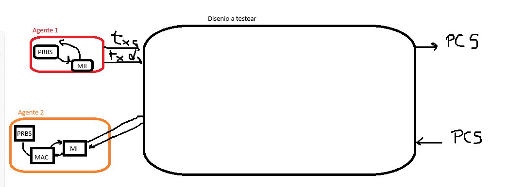

# TP4 — Verificación funcional de la PCS 10GBASE-R de *taxi*

Objetivo: partir de diseños existentes (repositorio [fpganinja/taxi](https://github.com/fpganinja/taxi)),
escribir un **plan de verificación** y ejecutarlo para decidir si cada diseño **cumple o no la norma**
IEEE 802.3. Esta primera fase cubre el bloque **XGMII ↔ PCS 64B/66B** (cláusulas 46 y 49); la MAC
(`taxi_eth_mac_10g`) y el MAC+PHY (`taxi_eth_mac_phy_10g`) quedan para las fases siguientes.

- Plan de verificación: [docs/plan_de_verificacion.md](docs/plan_de_verificacion.md)
- Puesta a punto del entorno (Ubuntu): [docs/entorno.md](docs/entorno.md)
- Entorno de verificación (cocotb + Verilator): [verif/](verif/)

## Notas de clase

Lo que pidió la cátedra hasta ahora:

- **Simulador**: Verilator antes que Icarus (además, el SystemVerilog de *taxi* no compila en Icarus).
- **Ondas**: generar `dump.fst` y analizarlas con GTKWave.
- **Primera entrega**: tener el entorno listo y partir de un buen plan de pruebas, **tratando a los
  diseños como IPs**.
- **Niveles**: verificación por módulo independiente y también integrada (en el top).
- **Por dónde empezar**: el bloque que traduce XGMII a PCS.
- **Agentes** (boceto de clase, abajo): *Agente 1* = PRBS → MII, que maneja `txc`/`txd` del diseño;
  *Agente 2* = MII → MAC → PRBS, que recibe lo que entrega el diseño. Del lado derecho del diseño,
  la PCS (salida y entrada).
- **Topologías**: primero conectar los agentes en **loopback** (PCS de salida → PCS de entrada) y
  después en **full duplex**.
- **Alcance actual**: solo PCS–MII; de la MAC en adelante, más adelante.



### "Tratar los diseños como IPs"

Un *IP* (*intellectual property core*) es un bloque reutilizable que se integra como una caja cerrada:
quien lo usa conoce su interfaz y la especificación que dice cumplir, no su implementación. Verificarlo
"como IP" implica:

1. **Caja negra**: se estimula y se observa solo por los puertos, y lo esperado sale de la **norma**,
   no del código RTL. El RTL se mira únicamente para saber qué puertos, parámetros y convenciones de
   bits tiene la interfaz.
2. **Modelo de referencia independiente**: el "juez" se escribe a partir de IEEE 802.3. No se reutilizan
   los modelos del mismo autor del diseño (`cocotbext-eth`, `baser.py` de *taxi*), porque compartirían
   sus mismas interpretaciones de la norma (error de modo común).
3. **Componentes de verificación reutilizables** (*verification IP*, VIP): un agente por interfaz
   (XGMII, PCS de 66 bits) que sirve igual en las pruebas de unidad, en el top y en la integración.
4. **Cierre medible**: lista de requisitos con trazabilidad a la norma, cobertura funcional y criterio
   de aprobación por requisito.

## Arquitectura de verificación

```text
 Loopback (un PHY)
 +-------------------------+     +---------------------- taxi_eth_phy_10g ----------------------+
 | Agente 1                |txd  |  XGMII TX -> encoder 64B/66B -> scrambler --> serdes_tx ------+--+
 |  PRBS -> MII (driver)   |txc  |                                                               |  | canal PCS
 +-------------------------+---->|                                                               |  | (retardo, errores
 +-------------------------+     |                                                               |  |  de bit, bit-slip)
 | Agente 2                |rxd  |  XGMII RX <- decoder <- descrambler <- block lock <- serdes_rx<+--+
 |  MII -> MAC -> PRBS     |<----|                           BER monitor                         |
 +-------------------------+rxc  +---------------------------------------------------------------+

 Full duplex (dos PHY espalda con espalda)
   Agente 1A -> PHY A TX -> canal A->B -> PHY B RX -> Agente 2B
   Agente 2A <- PHY A RX <- canal B->A <- PHY B TX <- Agente 1B
```

| Pieza del boceto | Implementación | Archivo |
|---|---|---|
| Agente 1: PRBS | `PrbsGenerator` (x³¹+x²⁸+1 por defecto) | `verif/vip/prbs.py` |
| Agente 1: MII | `XgmiiDriver` + `XgmiiStreamBuilder` (preámbulo, SFD, FCS, IPG/DIC, /S/ en carril 0 o 4) | `verif/vip/agents.py`, `verif/vip/xgmii.py` |
| Agente 2: MII | `XgmiiMonitor` | `verif/vip/agents.py` |
| Agente 2: MAC | `XgmiiFrameParser` (/S/../T/, preámbulo/SFD, FCS, /E/, Local Fault) | `verif/vip/xgmii.py` |
| Agente 2: PRBS | `PrbsChecker` auto-sincronizante con *lock/unlock* (como el chequeador del TP2) | `verif/vip/prbs.py` |
| PCS salida / entrada | `PcsMonitor`, `PcsDriver`, `Channel` (loopback/full duplex, errores, bit-slip) | `verif/vip/agents.py` |
| "Juez" | modelo de referencia de la cláusula 49 (codificación, máquinas de estado TX/RX, scrambler, block lock) | `verif/vip/baser.py` |

## Diseño bajo prueba

Repositorio `fpganinja/taxi`, commit `cc70b27` (2026-08-28). No se versiona dentro de este repo:
se clona con `scripts/get_taxi.sh` en `TP4/repo_taxi/taxi/` (ignorado por git).

| Nivel | Módulo | Qué hace |
|---|---|---|
| Unidad | `src/eth/rtl/taxi_xgmii_baser_enc.sv` | XGMII → bloques 64B/66B (sin scrambler) |
| Unidad | `src/eth/rtl/taxi_xgmii_baser_dec.sv` | bloques 64B/66B → XGMII |
| Top | `src/eth/rtl/taxi_eth_phy_10g.sv` (+ `.f`) | PCS completa: `_tx` (encoder + scrambler + PRBS31) y `_rx` (block lock, BER monitor, watchdog, descrambler, decoder) |
| Integración | 2 × `taxi_eth_phy_10g` (`verif/tb/eth_phy_10g_duplex/tb_eth_phy_10g_duplex.sv`) | enlace full duplex |
| Fase 2 | `taxi_eth_mac_10g`, `taxi_eth_mac_phy_10g` | MAC 10G y MAC+PCS |

## Estructura

```text
TP4/
├── README.md                  este archivo (notas de clase, arquitectura, estado)
├── docs/
│   ├── plan_de_verificacion.md  requisitos, casos de prueba, cobertura, criterios
│   ├── entorno.md               instalación en Ubuntu y uso (make, ondas, semillas)
│   ├── Tutorial - cocotb.pdf    tutorial de la cátedra (verilog-ethernet + Icarus)
│   └── img/
├── scripts/
│   ├── setup_ubuntu.sh          paquetes, Verilator desde fuente, venv, clon del DUT
│   └── get_taxi.sh              clona taxi en el commit fijado
├── repo_taxi/taxi/              DUT (no versionado)
└── verif/
    ├── vip/                     agentes, modelo de referencia, scoreboard, cobertura
    ├── selftest/                pruebas del propio VIP (pytest, sin simulador)
    ├── tb/                      un directorio por testbench (Makefile + test_*.py)
    │   ├── xgmii_baser_enc/     unidad: encoder
    │   ├── xgmii_baser_dec/     unidad: decoder
    │   ├── eth_phy_10g/         top: TX, RX, lock, BER, Local Fault, loopback, PRBS31
    │   └── eth_phy_10g_duplex/  integración: dos PHY en full duplex
    ├── tools/summarize_results.py
    ├── Makefile                 regresión completa + tabla resumen
    └── requirements.txt
```

## Uso rápido (Ubuntu)

```bash
bash TP4/scripts/setup_ubuntu.sh            # una sola vez
source TP4/verif/.venv/bin/activate         # en cada terminal nueva
cd TP4/verif && make selftest               # pruebas del VIP (segundos)
cd TP4/verif/tb/eth_phy_10g && make         # un testbench, genera dump.fst
make waves                                  # abre GTKWave
cd TP4/verif && make                        # regresión completa + reports/summary.md
```

Detalles, variables (`WAVES`, `COCOTB_TEST_FILTER`, `COCOTB_RANDOM_SEED`, `COUNT_125US`) y
problemas frecuentes en [docs/entorno.md](docs/entorno.md).

## Estado

| Ítem | Estado |
|---|---|
| Notas de clase, alcance, arquitectura | listo |
| Plan de verificación (requisitos, casos, cobertura, criterios) | listo, versión 1 |
| Scripts de entorno para Ubuntu | escritos, sin probar en la laptop |
| VIP: modelo de referencia, PRBS, armado/parseo de tramas, emulación de línea | **53/53 self-tests pasan** (Python 3.12, sin simulador) |
| Testbenches cocotb (enc, dec, PHY, full duplex) | escritos; importan con cocotb 2.0.1; **falta correrlos con Verilator** |
| Ejecución, resultados y hallazgos | pendiente (en la laptop con Ubuntu) |
| Fase 2: MAC 10G y MAC+PCS | pendiente |

## Próximos pasos

1. En Ubuntu: `scripts/setup_ubuntu.sh` y correr un test upstream de taxi como chequeo del entorno.
2. `make selftest` y luego cada testbench con `WAVES=1`; revisar en GTKWave los primeros casos.
3. Ajustar lo que haga falta en los testbenches (primera ejecución real).
4. Completar la columna "Resultado" del plan y redactar los hallazgos (en norma / no en norma, con
   evidencia: log, tiempo de simulación y captura de GTKWave).
5. Fase 2: reutilizar los agentes para la MAC (`taxi_eth_mac_10g`) y el MAC+PCS.
